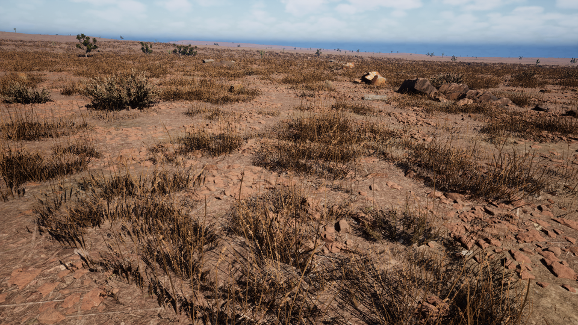
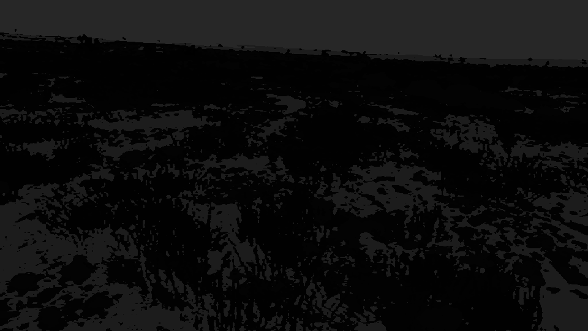
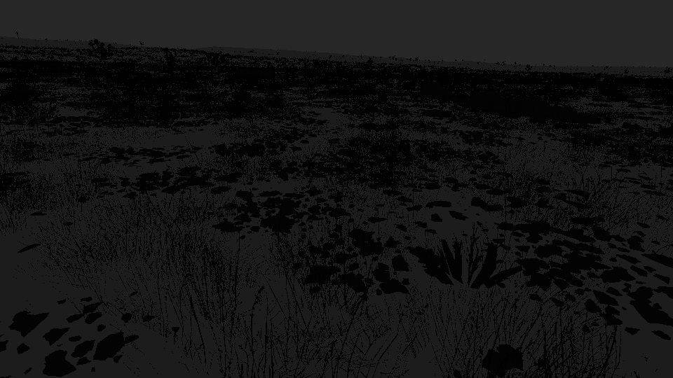
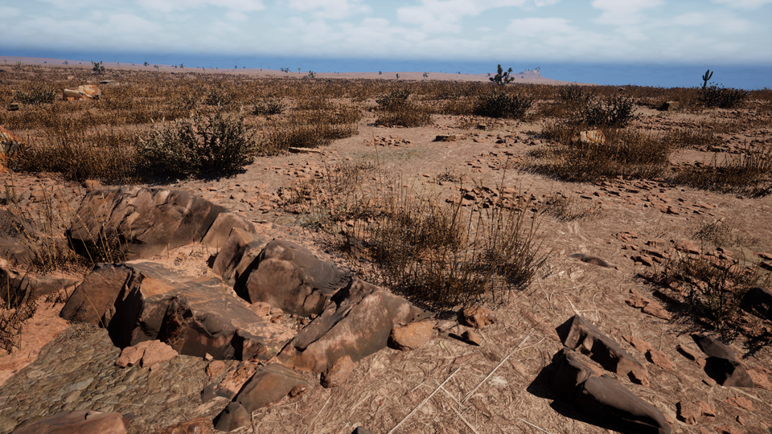
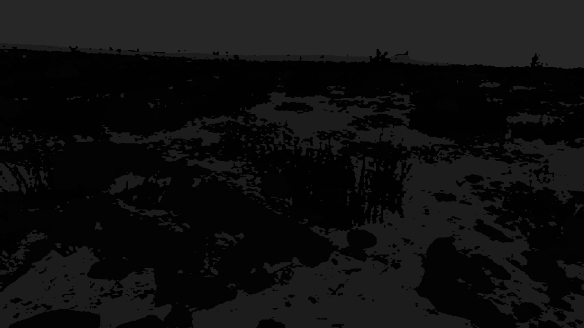
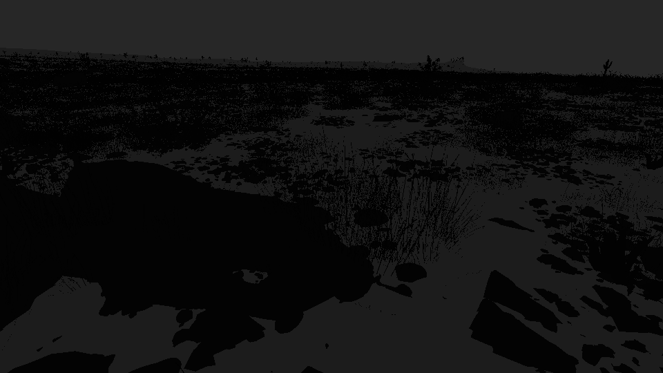
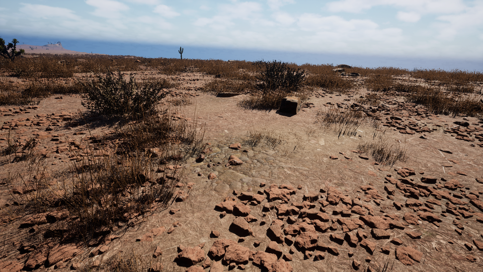
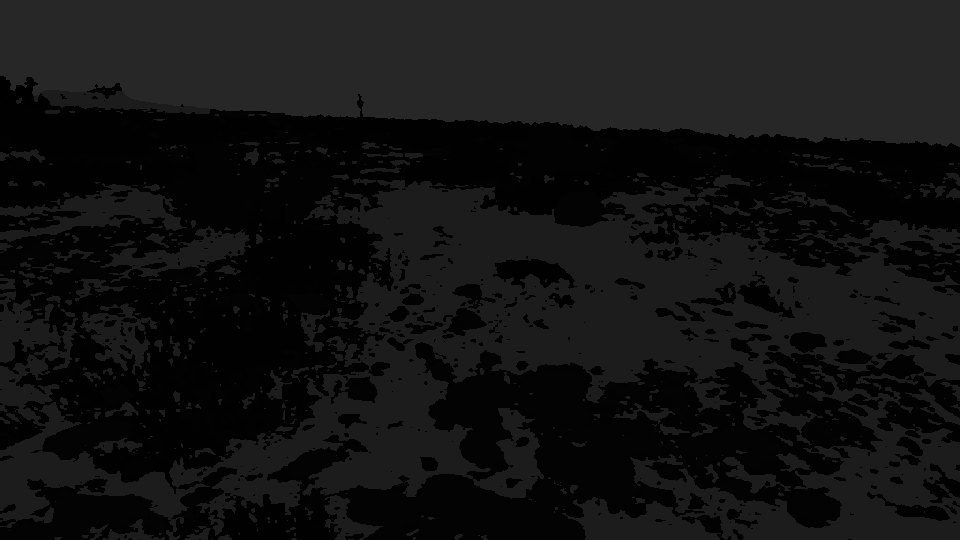

# Duality_MLSIN28
# Duality_KSR: Robust Semantic Segmentation for Off-Road Environments

## Summary
**Duality_KSR** is a high-performance semantic segmentation system designed to classify unstructured off-road environments. Built upon the **SegFormer-B2** architecture, this project focuses on robustly identifying 10 distinct classes (e.g., *Trees, Rocks, Sky, Dry Grass*) under varying lighting and texture conditions. By leveraging **Heavy Augmentation** and **Test-Time Techniques (TTA)**, the model achieves strong generalization, particularly in distinguishing difficult classes like Rocks and Dry Grass.

---

## 🚀 Step-by-Step Instructions

### 1. Installation
Ensure you have a GPU-enabled environment.

```bash
# Download the zip file from Google drive (in section 4)
Unzip and set up

# Create the conda environment
conda env create -f environment.yml

# Activate the environment
conda activate EDU
```

### 2. Training the Model
To reproduce the training results, run the training script. This uses a **LegalDataset** loader with heavy augmentations to simulate test conditions.

```bash
python train.py
```
*Key Configurations:*
- **Model**: SegFormer-B2 (Pretrained on ImageNet)
- **Resolution**: 512x512 (Training)
- **Augmentations**: Color Jitter, Gaussian Blur, Flip (Simulating Sun/Shade/Dust)

### 3. Running Inference
To generate predictions on the test set, use the testing script. This applies **High-Resolution Inference (1024x1024)** and **Test-Time Augmentation (TTA)** for maximum accuracy.

```bash
python test.py
```
*Outputs will be saved to the `outputs_best_model/` directory.*

---

## 📊 Performance & Metrics

### Training Loss & Accuracy Trends
*(Include a graph here showing Training Loss vs. Epochs from your runs/ folder)*

### Final Evaluation Results
Our best model (`segformer_b2_best.pth`) achieves a **Mean IoU of 29.85%** on the Test Set. The detailed breakdown is:

| Class Name           | IoU (%) | Precision (%) | Recall (%) | F1-Score | Status         |
| :------------------- | :------ | :------------ | :--------- | :------- | :------------- |
| **Sky**              | 98.22   | 98.49         | 99.73      | 0.9910   | Excellent      |
| **Landscape**        | 59.18   | 91.57         | 62.59      | 0.7436   | Strong         |
| **Dry Grass**        | 46.74   | 54.59         | 76.47      | 0.6370   | Good           |
| **Trees**            | 40.57   | 74.99         | 46.91      | 0.5772   | Robust         |
| **Dry Bushes**       | 29.79   | 48.19         | 43.82      | 0.4590   | Acceptable     |
| **Rocks**            | 23.95   | 60.44         | 28.40      | 0.3864   | **Key Success**|
| Ground Clutter       | 0.00    | 0.00          | 0.00       | 0.0000   | Weak           |
| Flowers              | 0.00    | 0.00          | 0.00       | 0.0000   | Overfit        |
| Lush Bushes          | 0.02    | 0.02          | 27.03      | 0.0004   | Overfit        |
| Logs                 | 0.00    | 0.00          | 0.00       | 0.0000   | Overfit        |
| **MEAN SCORE**       | **29.85**| **42.83**    | **38.50**  | **0.3795**| -              |

> **Note**: The model shows exceptional performance on "Macro" classes (Sky, Landscape) and critical success on difficult "Micro" classes like Rocks, despite a challenging domain gap.

---

## 📷 Visuals & Qualitative Results

### Workflow Diagram
*(Insert a flowchart here: Input Image -> Preprocessing (Resize/Norm) -> SegFormer-B2 -> Decoding -> Output Mask)*

### Before & After Examples
Here are some qualitative results from the Test Set:

| Input Image | Predicted Mask | Ground Truth |
| :---: | :---: | :---: |
|  |  |  |
|  |  |  |
|  |  |  |

---

## 📝 Documentation of Techniques

### 1. Dataset Manipulation
- **Heavy Augmentation**: To combat overfitting, we implemented aggressive `ColorJitter` (brightness/contrast changes) and `GaussianBlur`. This allows the model to generalize to "unseen" lighting conditions (e.g., recognizing a rock whether it is in direct sunlight or shadow).
- **Resolution Strategy**: Trained at **512x512** for speed and regularization, but inferred at **1024x1024** to capture fine details (like small rocks).

### 2. Training Process
- **Optimizer**: AdamW with a low learning rate (`2e-5`) for fine-tuning.
- **Loss Function**: CrossEntropyLoss.
- **Mixed Precision**: utilized `torch.cuda.amp` for memory efficiency.

### 3. Test-Time Optimization
- **TTA (Test-Time Augmentation)**: We average predictions from the original image and a horizontally flipped version.
- **Class Bias**: We apply a subtle logit bias to under-represented classes (like Rocks and Logs) during inference to boost their recall without retraining.
### 4. Resource 
- **whole project zip file drive link** - https://drive.google.com/file/d/1ITnsHs1Kanob5tdvqZ77_ecVwmjuQ7lz/view?usp=sharing.
- **Documentation** - https://drive.google.com/file/d/12Lm9FA2w8WucLJXHlaoyFl_gzHERKQd4/view?usp=drivesdk
